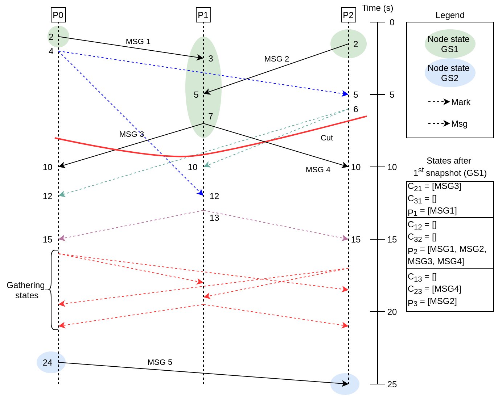
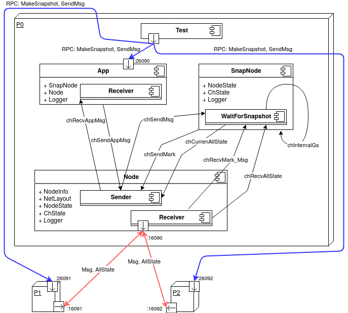
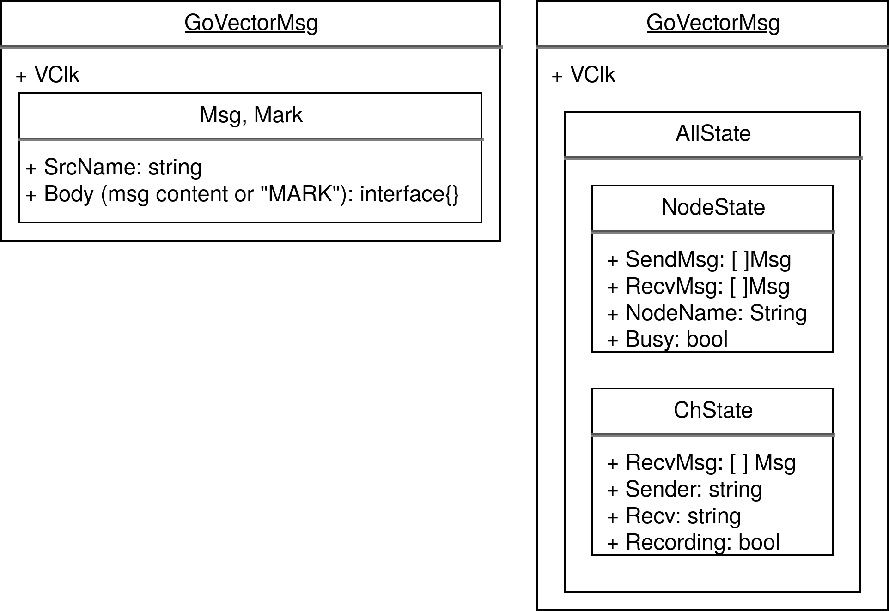
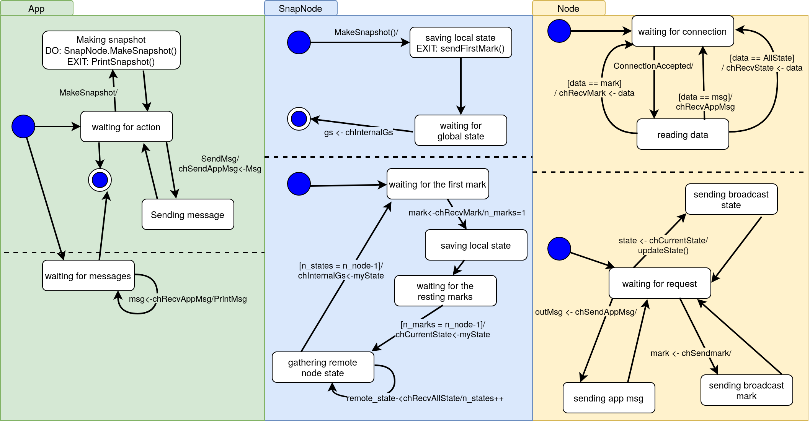

# GlobalStateSnapshot
Design, implementation, and evaluation of the Chandy-Lamport algorithm for snapshotting the global 
state of a distributed system.
```@article{chandy1985distributed,
  title={Distributed snapshots: Determining global states of distributed systems},
  author={Chandy, K Mani and Lamport, Leslie},
  journal={ACM Transactions on Computer Systems (TOCS)},
  volume={3},
  number={1},
  pages={63--75},
  year={1985},
  publisher={ACM New York, NY, USA}
}
```

This project use [GoVector](https://github.com/DistributedClocks/GoVector) for drawing the trace of the network messages sent 
among the nodes to perform the global snapshot.
  

# Setup
- File `github.com/DistributedClocks/GoVector/govec/govec.go` : replace line 431 for 
print real timestamps on nanoseconds to readable format
>- Original content: `buffer.WriteString(strconv.FormatInt(time.Now().UnixNano(), 10))`  
>- New time printer: `dt := time.Now()`   
&nbsp;&nbsp;&nbsp;&nbsp;&nbsp;&nbsp;&nbsp;&nbsp;&nbsp;&nbsp;&nbsp;&nbsp;&nbsp;&nbsp;&nbsp;&nbsp;&nbsp;
&nbsp;&nbsp;&nbsp;&nbsp;&nbsp;&nbsp;&nbsp;&nbsp;&nbsp;&nbsp;
`buffer.WriteString(dt.Format(time.StampMilli))` 

- If you get an error related with arguments number for `dec.Decode()` at compiling time, 
you must also replace the line 209 of `govec.go` file: `err = dec.Decode(&d.Pid, &d.Payload, &d.VcMap)` &rarr;
 `err = dec.DecodeMulti(&d.Pid, &d.Payload, &d.VcMap)`    
This error is due to the fact that the used package `github.com/vmihailenco/msgpack` is newer than the one
supported by the GoVector package.  

# Usage
1) Setup your network layout on file `network.json`. For each node, you must insert node IP, RPC port and app port. 
2) In order to execute the test depicted on the below figure, run it: 
```
./run.sh
```


It will create a `output` dir with app logs and GoVector logs.
3) Use the `output/completeGoVectorLog.log` file for printing the trace of the Chandy-Lamport algorithm for 
snapshotting the global state on [Shiviz](https://bestchai.bitbucket.io/shiviz/) .


# Doc
Please check out the [Spanish report](memoria.pdf) for a closer specification of the system.


Deployment view. 

Each component corresponds to a goroutine. 
The system is composed of 3 different components: _App_ (used by the user to send the messages), _Node_ (message broker)
and _SnapNode_ (manage the global state snapshot). The arrows between these components are GoLang channel
to communicate goroutines.
Red arrows are communication between 
processes through TCP. In other words, they are used to sending marks, local state of 
a process, and application messages. By means, the blue arrows RPC commands are being 
sent to execute tests.


Types of messages used for the CL algorithm. (Msgs sent by red arrows/TCP communications)


State diagram which details the behavior of each component on the system.


 


